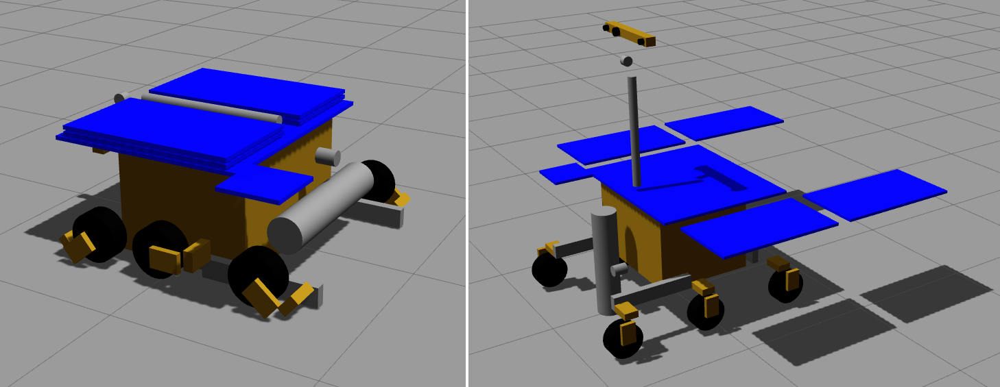

# ExoMars Rover Simulation

## Overview

This repository hosts the European Space Angency's (ESA) [ExoMars rover](https://en.wikipedia.org/wiki/ExoMars_(rover)) URDF/Xacro files for use with simulators like [Gazebo](http://gazebosim.org/) and visualizers like [Rviz](https://github.com/ros-visualization/rviz). This work is a personal project and is not sponsored.

The rover coordinate frames adhere with [REP 105: Coordinate Frames for Mobile Platforms](http://www.ros.org/reps/rep-0105.html).

The rover is an approximation of the dynamics and kinematics of ExoMars. It does not accurately represent the actual ExoMars rover in shape or form.

The cameras are placed roughly in the locations where they are meant to be and follow [ESA specifications](https://www.liebertpub.com/doi/10.1089/ast.2016.1548).

When Gazebo starts the simulator is paused, since there are no controllers loaded the actuators are not being actively provided a set point, unpausing will make all actuators backdrive.

**Keywords:** exomars, simulation, gazebo, rover, esa, mars

### License

The source code is released under a [MIT license](LICENSE).

**Author(s): Karl Kangur  
Maintainer: Karl Kangur, karl.kangur@gmail.com  
Affiliation: private**

The ExoMars Rover Simulation package has been tested under ROS Kinetic and Ubuntu 16.04.

## Installation

### Building from Source

#### Dependencies

* [Robot Operating System (ROS)](http://wiki.ros.org)
* Gazebo

#### Building

To build from source, clone the latest version from this repository into your catkin workspace and compile the package using

	cd catkin_ws/src
	git clone https://github.com/Nurgak/exomars_description.git
	catkin build

## Usage

Run the main node with

	roslaunch exomars_description exomars_description.launch

## Launch files

* **exomars_description.launch:** this package starts Gazebo and loads the ExoMars rover to the scene. The simulation starts in paused mode.

     - **`deployed`** Load the rover in deployed mode (wheels, solar panels, pan-tilt-unit and pancam), otherwise all stowed. Default: `true`.

## Files

* **exomars.xacro:** contains the main body (base_link) of ExoMars and load the following files
* **exomars_locomotion.xacro:** bogies, steering, driving and wheel-walking joints and transmissions
* **exomars_power.xacro:** solar panels and the joints and transmissions
* **exomars_sensor.xacro:** pan-tilt-unit, actuated joints and cameras (WAC and HRC)
* **exomars_drill.xacro:** front drill housnig and actuators
* **materials.xacro:** materials definition used by Rviz
* **exomars.gazebo:** Gazebo plugins and material definitions for all elements for Gazebo
